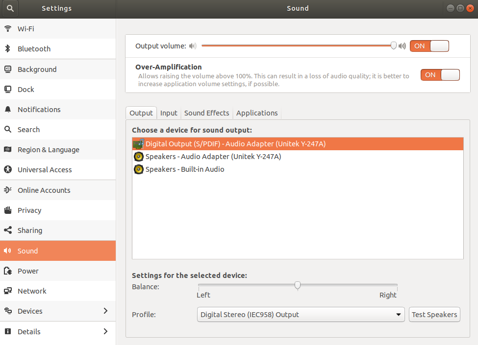

# Error_Audio（能够识别声卡插入，无法选择声卡输出问题）

---

## 问题描述： ##

环境：Ubuntu 18:04

问题图片（显示的图片为已修复好的）：



文字描述：图中的output部分为完全空白。

补充描述：

```shell
uubs@uubs:~$ cat /proc/asound/cards  # 查看声卡
 0 [HDMI           ]: HDA-Intel - HDA Intel HDMI
                      HDA Intel HDMI at 0xf7a14000 irq 35
 1 [PCH            ]: HDA-Intel - HDA Intel PCH
                      HDA Intel PCH at 0xf7a10000 irq 34
 2 [Device         ]: USB-Audio - USB Audio Device
                      C-Media Electronics Inc. USB Audio Device at usb-0000:00:14.0-3, full speed

```

```shell
uubs@uubs:~$ pulseaudio --check # 显示是否有pulseaudio实例在运行
#此处无输出表示无正在运行的实例
```

```shell
pulseaudio -k # 杀死正在运行的实例
```

```shell
uubs@uubs:~$ pulseaudio -D #以守护进程启动pulseaudio
E: [pulseaudio] main.c: Daemon startup failed. # 输出错误
```

## 解决方案：

``` shell
uubs@uubs:~$ sudo apt-get remove --purge alsa-base pulseaudio #卸载
uubs@uubs:~$ sudo apt-get install alsa-base pulseaudio # 安装

uubs@uubs:~$ sudo alsa force-reload # reload alsa
uubs@uubs:~$ pulseaudio -D
# 此处无输出表示正确执行，同时得到开篇的图像
```

## 原因分析：

本文中出现的问题，是由于想要通过蓝牙耳机连接上电脑，更改了某些设置（具体也不知道到底更改了哪些），导致连普通音频输出都出现问题。但是，究竟是什么原因造成这样的结果，自己并不是很明了。

### 下一步 ###

在本次问题的解决中，其实一个突破点便是对于log的输出信息，目前对这方面依然不明所以，下一步要精进对 [log]() 的学习

---

**reference**

1. https://bugs.launchpad.net/ubuntu/+source/pulseaudio/+bug/1720519
2. https://unix.stackexchange.com/questions/430376/pulseaudio-does-not-start
3. https://bbs.archlinux.org/viewtopic.php?id=159605
4. [https://www.it-swarm.dev/zh/pulseaudio/%E5%A6%82%E4%BD%95%E5%9C%A8%E4%B8%8D%E9%80%80%E5%87%BA%E7%9A%84%E6%83%85%E5%86%B5%E4%B8%8B%E9%87%8D%E6%96%B0%E5%90%AF%E5%8A%A8pulseaudio%EF%BC%9F/957167095/](https://www.it-swarm.dev/zh/pulseaudio/如何在不退出的情况下重新启动pulseaudio？/957167095/)

